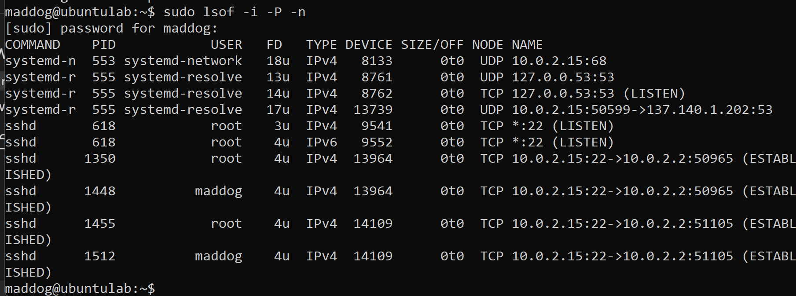
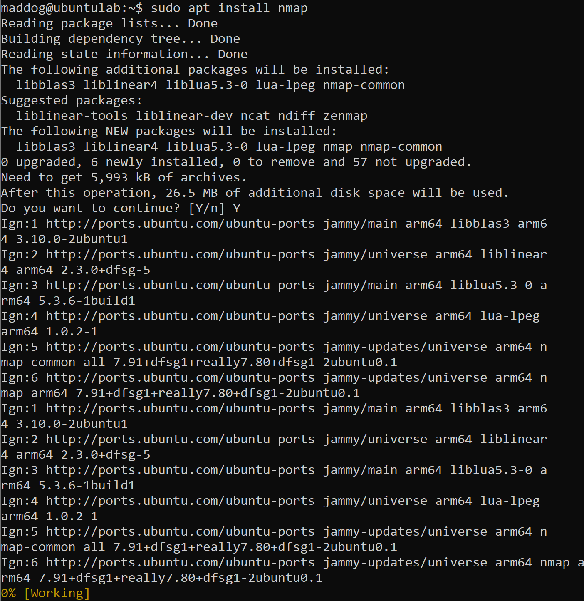
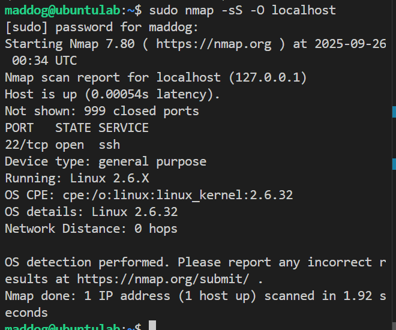
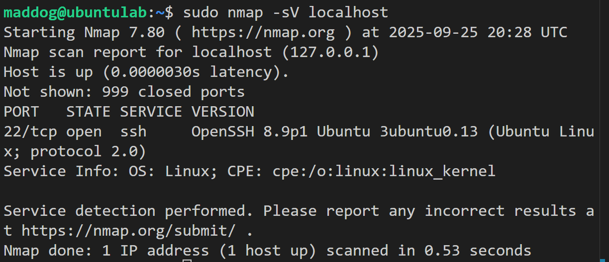
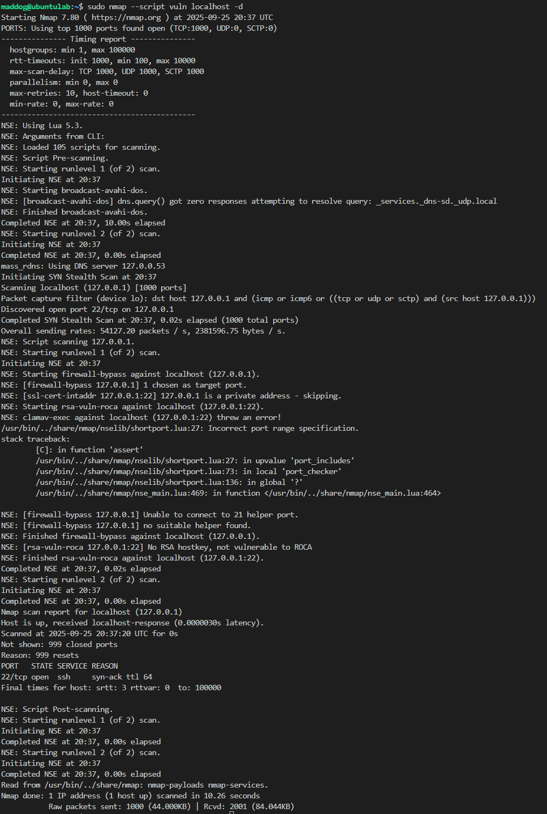

# Exploring Ubuntu ### Overview## 3. Analyze Network Connections

**Key terms explained:**
- **COMMAND / PID / USER** – Shows which process owns the socket
- **FD** – File descriptor (the 'u' means it's open for reading/writing)
- **TYPE** – Indicates IPv4 vs IPv6 connections
- **NAME** – Shows protocol, local IP:port → remote IP:port, plus connection state for TCP

**Process explanations:**
- **sshd** = SSH server listening/active
- **systemd-networkd** = DHCP client managing network configuration
- **systemd-resolved** = Local DNS resolver service

### Overview:
Only SSH (port 22/tcp) is exposed and actively listening. DNS service (systemd-resolved) is restricted to loopback-only access for security. Outbound DNS queries are directed to 137.140.1.202, which was provided by the DHCP server. Two established SSH sessions are visible from the host machine (users: root and maddog), which appear internally as connections from 10.0.2.2.essfully connected to a network using NAT with the address 10.0.2.15. We can ping ubuntu.com to test outbound connectivity. From outside the VM (such as from Windows host), you cannot connect directly to 10.0.2.15 because NAT hides the internal address. This is why port forwarding is required for SSH access (Host Port 2222 → Guest Port 22).me Lab
- The following Ubuntu commands and tools were executed inside a VM using Oracle VirtualBox. **Special Note:** To enable quality-of-life features (such as Ctrl + C, Ctrl + V), my laptop uses a 64-bit installer with ARM architecture. Because of this, port-forwarding occurred using Bitvise SSH client. The VirtualBox guest ran on port 22, and my laptop (host) connected via port 2222.
- All outputs are included as screenshots, with key explanations for each particular tool. 

## 1. Identify Network Interfaces and IP Addresses

 
**Interface 1 (lo):**
- `lo:` represents the loopback interface, which every machine has
- `127.0.0.1` and `::1` represent localhost - this is the VM communicating with itself
  
**Interface 2 (enp0s8):**
- `enp0s8` is the Ethernet adapter created by VirtualBox's NAT network
- `08:00:27:3e:61:72` is the MAC address of this network adapter
- `inet 10.0.2.15/24` shows the IPv4 address assigned to my VM
  - This falls within VirtualBox's default NAT range (10.0.2.x)
- `inet6 fd17:625c:f037:2:a00:27ff:fe3e:6172/64` is a global IPv6 address (Unique Local Address for private networks)
- `inet6 fe80::a00:27ff:fe3e:6172/64` is a link-local IPv6 address (automatically assigned, only valid on the local network segment)

###  Overview:
The VM is successfully on a network -- NAT -- with address 10.0.2.15. Now, we can ping ubuntu.com to test outbound connectivity. From outside Ubuntu (such as Windows), you won’t connect directly to 10.0.2.15 (since NAT hides it). That’s why port forwarding to SSH in from your host is required (Host Port 2222 → Guest Port 22).

## 2. Check Open Ports
The `-tuln` options restrict the output to show only TCP (`-t`) and UDP (`-u`) ports in listening (`-l`) state without resolving names (`-n`).

### Overview:  
The only remotely accessible service is SSH on port 22. The VM acts as a DNS client. The DNS resolver is bound only to the loopback interface, preventing it from acting as a public DNS server. SSH server is running on port 22 and is available on all network interfaces. DHCP client is bound only to the local network interface.

## 3. Analyze Network Connections

Key terms:
- COMMAND / PID / USER – which process owns the socket.

- FD – file descriptor (the u means it’s open for reading/writing).

- TYPE – IPv4 vs IPv6.

- NAME – protocol, local IP:port → (possibly) remote IP:port, plus state for TCP.

- sshd = SSH server listening/active
- systemd-networkd = DHCP client
- systemd-resolved = local DNS resolver

### Overview:
Only SSH (22/tcp) is exposed and is listening.  DNS (systemd-resolved) is loopback-only. Outbound DNS queries go to 137.140.1.202, provided by DHCP.  Two established SSH sessions from the host (root and maddog), seen internally as 10.0.2.2.

## 4. Perform Network Scanning with Nmap

### Overview:  
The scan targets the localhost IP (127.0.0.1) and confirms the host is up with measured latency. It performs a stealth scan (`-sS`) which completed in 1.81 seconds. The operating system detection flag (`-O`) identifies the target as Linux 2.6.32. The stealth scan uses SYN packets without completing the TCP handshake, making it less detectable than full connection scans.  

## 5. Check for Open Ports on the Server's Network

### Overview: 
After scanning for all live hosts on the network using a ping scan (`-sP`), we can see that 256 IP addresses responded, indicating they are active hosts on this network. This technique is valuable for network discovery and identifying what devices are present on the local network segment.

## 6. Check for Services and Versions

### Overview: 
The `-sV` flag enables version detection during the scan. The results show that port 22 is the only open port, running SSH service with login capabilities available. The service information reveals: OS: Linux; CPE: cpe:/o:linux:linux_kernel. This version detection helps identify potential vulnerabilities associated with specific service versions.

## 7. Identify Potential Vulnerabilities

### Overview:
Nmap's scripting engine (`--script vuln`) runs approximately 105 vulnerability detection scripts against discovered services. These scripts search for security weaknesses, known vulnerabilities, authentication bypasses, firewall evasion techniques, buffer overflows, and weak or default passwords. The scan targets all open ports (in our case, port 22 on 127.0.0.1) to provide a comprehensive security assessment. 
## 8. Inspect Network Traffic
If we attempted to run `sudo tcpdump -i eth0`, we would encounter an error.

### Overview: 
Modern Linux distributions no longer use the traditional eth0 naming convention. Instead, my system uses `enp0s8`, which follows the predictable network interface naming scheme:
- **en** = Ethernet
- **p0** = PCI bus 0
- **s8** = Slot 8

This tcpdump output shows SSH traffic between my system (ubuntulab) and the gateway, along with some HTTP traffic. The predictable naming helps administrators identify the physical location and type of network interfaces.
## 9. Monitor Network Connections in Real Time

### Overview:
This command combines two utilities for real-time monitoring:

**`watch -n 1`** - Refreshes the display every 1 second
**`netstat -tulnp`** - Shows network connections with these flags:
- `-t` = TCP connections
- `-u` = UDP connections  
- `-l` = Listening ports only
- `-n` = Show numerical addresses (don't resolve hostnames)
- `-p` = Show process IDs and names (requires sudo privileges)

This combination provides a continuously updating view of all network activity on the system.
## 10. Check Firewall Rules

### Overview:
**Ubuntu Default Behavior:** Fresh Ubuntu installations often have UFW (Uncomplicated Firewall) disabled by default. The output shows that the firewall is currently inactive, which means no rules are being enforced. In a production environment, it would be recommended to enable and configure appropriate firewall rules to control network traffic and enhance security posture.

 