# Snort IDS Configuration Lab

This document demonstrates the installation and configuration of Snort Intrusion Detection System (IDS) on Ubuntu. I describe a guide to:
- Install and configure Snort with proper network settings
- Set up and manage detection rules for network monitoring
- Enable comprehensive logging and analyze security events
- Test and validate IDS functionality with network traffic

## Step 1: Update the System
### Overview:
Ensure your system is up to date before installing Snort using `sudo apt update` and `sudo apt upgrade -y`. This step guarantees compatibility and security by installing the latest packages and security patches before proceeding with Snort installation.

## Step 2: Install Snort
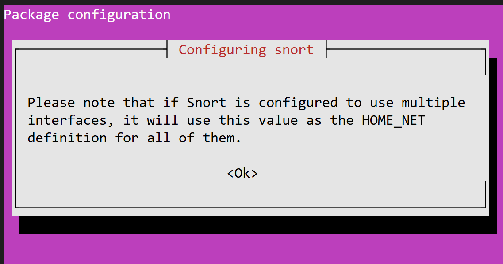

### Overview:
Installing Snort directly using `sudo apt install snort -y`. During installation, you will be prompted to enter the network interface and the HOME_NET IP range that Snort will monitor. You can find your network interface using `ip a` command. Set the Network Interface (e.g., eth0, enX0, ens33) and define your home network (e.g., 192.168.1.0/24 for a private network or any to monitor all networks).

## Step 3: Configure Snort
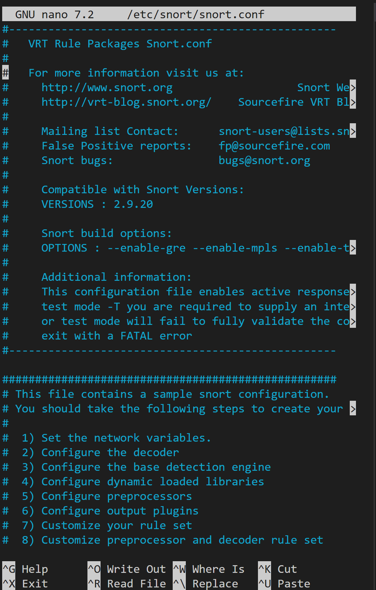

### Overview:
Customize the Snort configuration by opening the main configuration file with `sudo nano /etc/snort/snort.conf`. Key sections to check include ensuring the HOME_NET variable matches your network setup. You can adjust the ipvar HOME_NET if needed (e.g., `ipvar HOME_NET 192.168.1.0/24`). 

## Step 4: Update and Manage Snort Rules
### Overview:
By default, Snort comes with community rules, but you can download and add additional rules for better threat detection. Download community rules using:
-  `sudo wget https://www.snort.org/downloads/community/community-rules.tar.gz`, extract them with `sudo tar -xvzf community-rules.tar.gz`, and copy to rules directory with 
-  `sudo cp community-rules/* /etc/snort/rules/`. 
-  Add custom rules by editing `sudo nano /etc/snort/rules/local.rules` 
   -  Ex. `alert icmp any any -> any any (msg:"ICMP detected"; sid:1000001; rev:1;)`

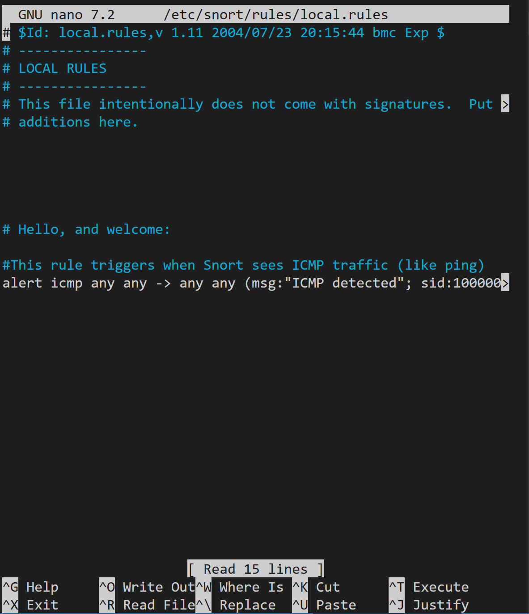


## Step 5: Test Snort Configuration
### Overview:
After configuring, test that Snort is working properly by running a configuration test with `sudo snort -T -c /etc/snort/snort.conf`. If the configuration is correct, you'll see a message like "Snort successfully validated the configuration!" 
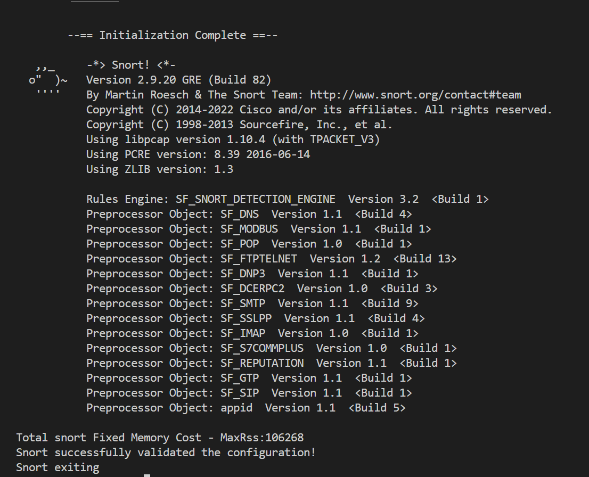


## Step 6: Running Snort in IDS Mode
### Overview:
Now that Snort is installed and configured, you can run it in **IDS mode** to monitor traffic by specifying the interface to monitor with 
- `sudo snort -c /etc/snort/snort.conf -i eth0` (replace eth0 with your interface). 

Snort will now monitor network traffic and log alerts. To exit, use Ctrl+C. This begins real-time network traffic monitoring and analysis.

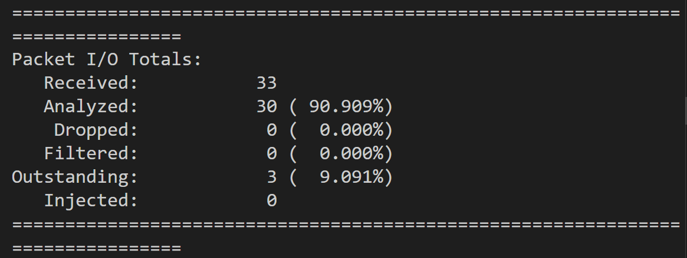
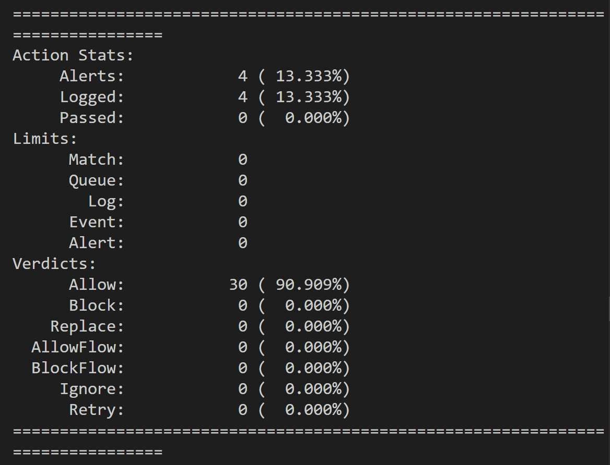
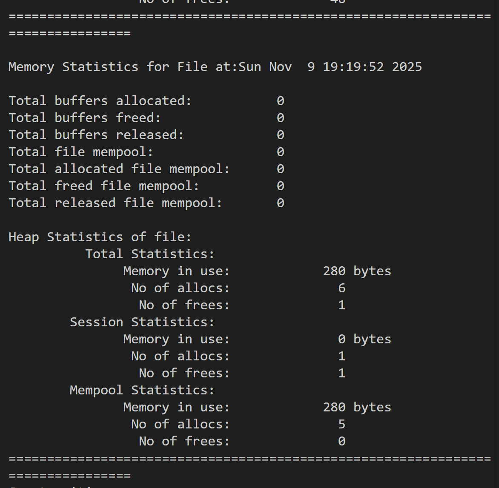


## Step 7: Viewing Snort Logs
### Overview:
Snort logs alerts in the `/var/log/snort/` directory. Navigate to this directory to examine what **files** are found and whether they contain any content. 
### Types of files:
- `snort.alert`
Standard alert logging format
Contains the full, detailed alerts

- `snort.alert.fast`
Same alerts, but condensed into 1 line per alert.
Fast to parse
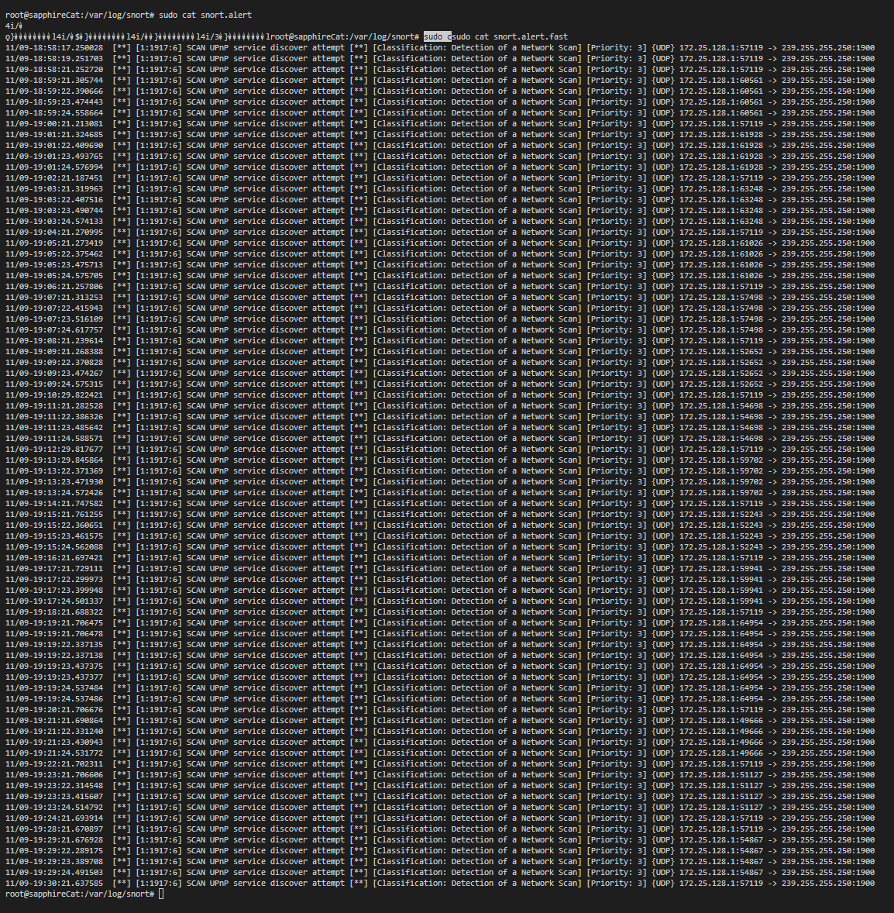


- `snort.log`
Raw packet capture.
Not human-readable.
Can be opened with Wireshark if needed.
### How we can access them:

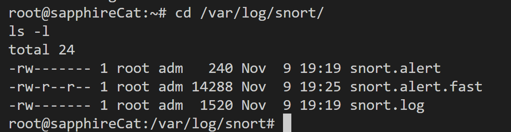


### Why some files were empty/garbled at the top (after catting them):
**Snort only writes alerts after matching rules**. Binary-looking content appears if the build writes unified2. The readable alerts are in `snort.alert.fast`

## Generate some traffic so see the rule applied:
### In a second terminal we can just ping a random IP:
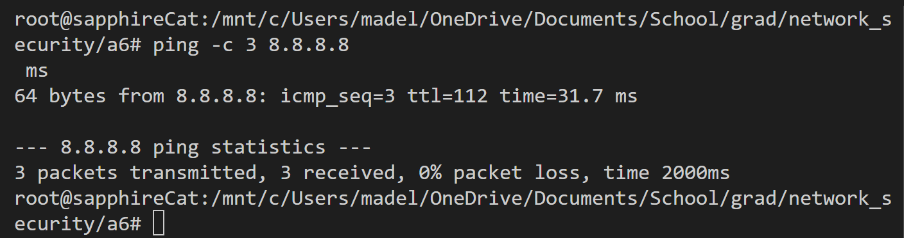
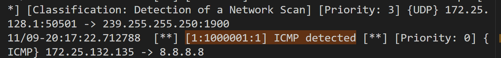
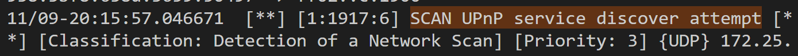


### Evidence of detections
- UPnP/SSDP background traffic repeatedly triggered rule `[1:1917:6] SCAN UPnP service discover attempt`.
- My custom rule fired:
  `[1:1000001:1] ICMP detected` for `172.25.132.135 <-> 8.8.8.8`.

### There is a handy command which allows you to see your custom alerts live:
```bash 
# show only your custom ICMP alerts
sudo grep 'ICMP detected' /var/log/snort/snort.alert.fast

# follow alerts live
sudo tail -f /var/log/snort/snort.alert.fast
```
### and then this occurs:
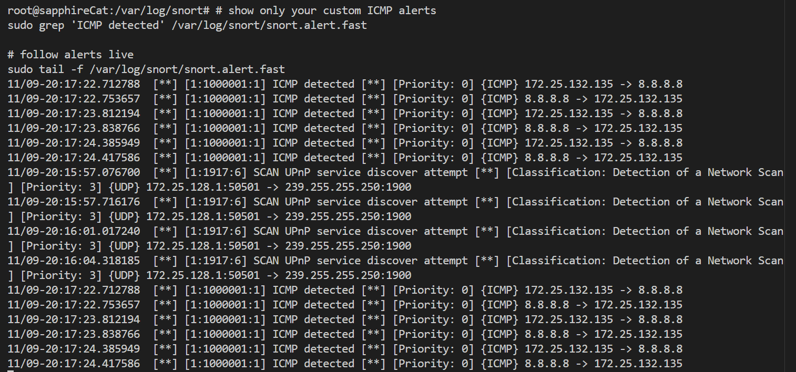


## Step 8: Running Snort as a Daemon
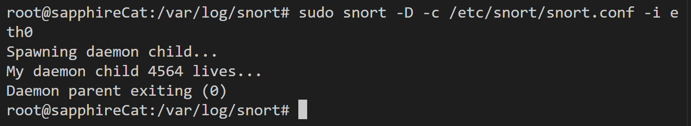

### Overview:
To run Snort in the background as a daemon, use
-  `sudo snort -D -c /etc/snort/snort.conf -i eth0` (specify your interface).
  
- D means "daemonize"
  
  This will keep Snort running in the background, continuously monitoring the specified network interface. Use the `top` command to see different processes running in your system; you should see Snort running after a few seconds. 

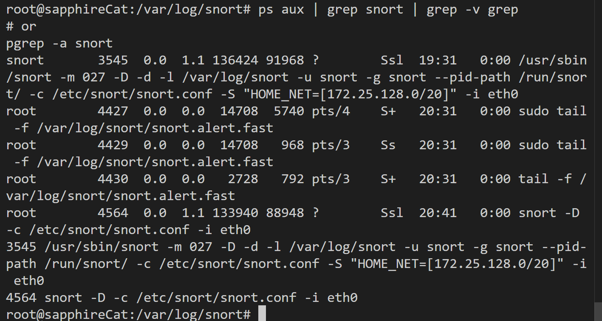

here we can see 3 packets (we pinged it earlier in another terminal) being sent to my local IP address, 24.161.103.172, as an example:
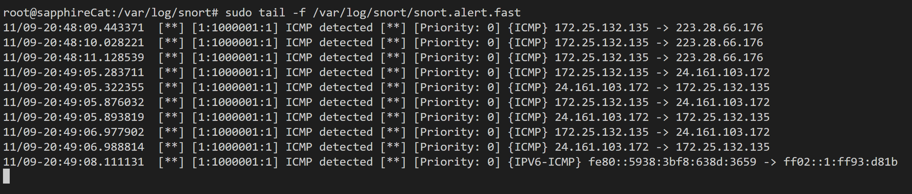

To stop the Snort process, you would use the terminate command to kill the process:
```bash
# simplest:
sudo pkill snort

# or find PID and kill
pgrep snort
sudo kill <PID>
```
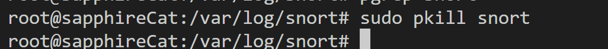


## Summary

This lab demonstrates Snort IDS configuration including:
- System prep + Snort installation 
- Config file customization and network interface setup
- Rule management = community rules and custom local rules
- Traffic generation: Sample ping testing procedures (8.8.8.8, my local IP address)
- Real-time IDS mode for monitoring the network
- implementing a Daemon

 By properly configuring rules and analyzing logs, admins can detect and respond to threats in real-time.
